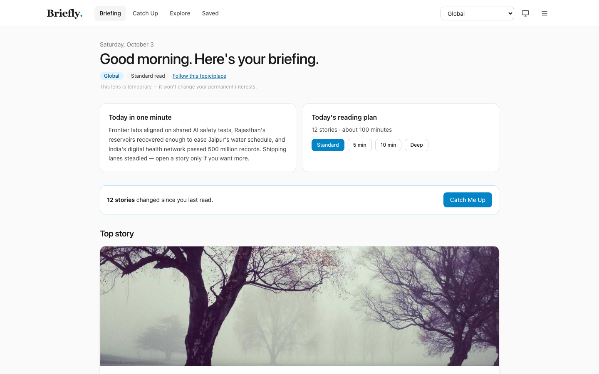
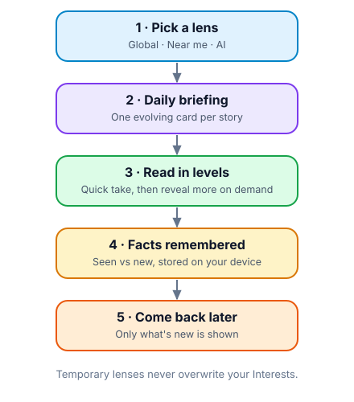
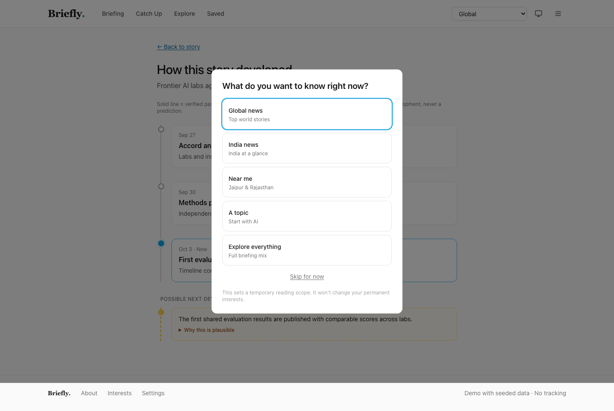
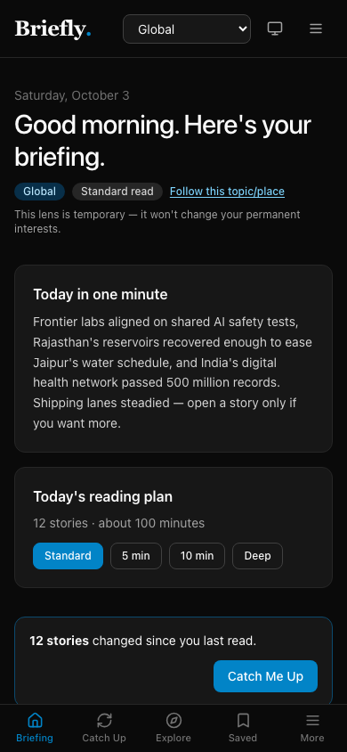
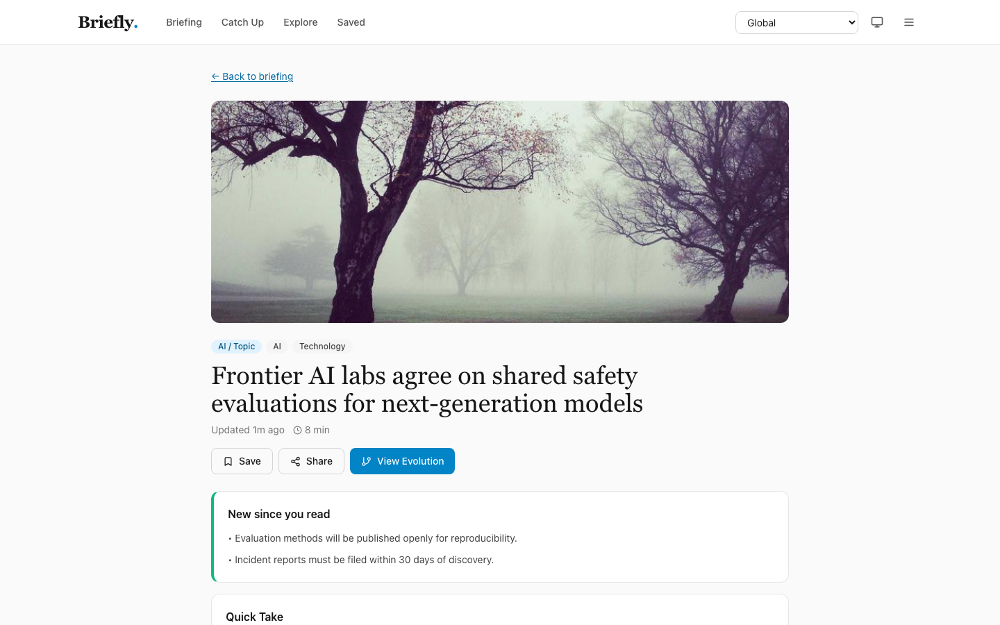

# Briefly — Personal News Intelligence

> “Show me what matters to me, at the level I want, without repeating what I already know.”

**Live site:** https://briefly-iota-one.vercel.app

Briefly is a calm, story-first daily briefing. Instead of a pile of near-duplicate
articles, each event is unified into **one evolving story card** with one clear
explanation. Stories start concise and reveal more only when you ask — and the app
remembers what you've already read, so return visits show **only what's new**.



---

## How it works



### The no-repeat engine

Every story is built from facts with stable IDs (`src/lib/data/stories.ts`).
The UI tracks which fact IDs you have actually rendered: unseen facts appear under
“New since you read”, seen ones collapse under “Previously covered”, and opening a
section marks its facts seen. If nothing is new, the app says so instead of
inventing an update.

Key helpers live in `src/lib/utils/storage.ts`:

| Helper | Purpose |
|---|---|
| `getUnseenFacts` | Facts in a story the reader hasn't seen yet |
| `getStoryUpdateView` | Splits a story into unseen / seen + status line |
| `markFactAsSeen` / `markFactsAsSeen` | Records facts only after their section is rendered |
| `rankStories` | Orders feeds by freshness, scope, follows, and unseen count |

If a story has no new facts, the app says so plainly instead of inventing an update.

### Verified history vs possible futures

Timelines use a **solid line** for verified events, highlight **Now**, and allow at
most **one** future item on a **dashed** line labelled
“Possible next development — not a prediction”, with a “Why this is plausible” note
only when the seed data includes evidence. It never looks like a confirmed fact.



---

## Screenshots

<p align="center">
  
</p>



---

## Features

- **Daily Briefing** — greeting, one-minute summary, reading plan, snapshot chips,
  one featured top story, capped story grid. No duplicates, no infinite scroll.
- **Session lenses** — switch Global / National / Regional / Local / Topic any time.
  Temporary by design; permanent interests only change via explicit “Follow”.
- **Your location** — set country, region, city under Interests; lens labels follow it.
- **Progressive story reading** — Quick Take → Key Developments → Why It Matters →
  Context & Deep Dive (with discreet source links). Nothing is shown all at once.
- **Catch Me Up** — Since last visit / 24h / 3d / 7d, ordered by importance, no scary
  unread counts.
- **Explore** — scope tabs, region drilldown, topic chips, date/content/depth filters,
  plus a “What should I know?” box that parses supported topic/place/time phrases
  into filters (no fake chatbot).
- **Story Evolution** — adaptive timeline, vertical on mobile, one dashed future line.
- **Saved queue** — Quick reads (≤5 min) / 10–15 min / Deep dives, with “New update”
  labels and mark-read.
- **Interests & Settings** — topics with priority, places, content mix, default scope,
  theme (system/light/dark), reading mode, and confirmed destructive actions
  (clear history, clear saved, reset demo).
- **Dark + light modes**, responsive with mobile bottom nav, keyboard-accessible
  dialogs/disclosures, `prefers-reduced-motion` support.

## Routes

| Route | Page |
|---|---|
| `/` | Daily Briefing |
| `/catch-up` | Catch Me Up |
| `/explore` | Scopes, topics, filters |
| `/story/[storyId]` | Story detail (progressive disclosure) |
| `/story/[storyId]/evolution` | Story timeline graph |
| `/saved` | Reading queue |
| `/interests` | Permanent preferences + location |
| `/settings` | Theme, reading mode, data controls |
| `/about` | Story-first approach, demo notes |

## Tech

- Next.js 14 (App Router) + TypeScript + Tailwind CSS (`darkMode: 'class'`)
- Local seed data: 12 stories across Global, National, Regional/Local, AI,
  Technology, Science, Sports, Business, Health, Environment, Culture —
  including ongoing multi-milestone stories, two research items, and one
  carefully-worded future possibility
- `localStorage` for theme, session scope, saved stories, reading history,
  seen facts, location, and preferences — no accounts, no tracking
- Photos are stable placeholders; no API keys, scraping, or paid services

## Run locally

```bash
npm install
npm run dev
# open http://localhost:3000
```

## Build & deploy (Vercel)

```bash
npm run build
npm start
```

To deploy: push to GitHub, then Vercel → **New Project → Import** the repo.
Framework preset **Next.js**, build command `npm run build`, no environment
variables needed. Every push to `main` redeploys automatically.

## Demo notes & limits

- Seed coverage is centred on Jaipur, India; custom locations relabel the lenses
  while demo content stays Jaipur-based.
- “Near me” and Explore parsing understand the demo places plus your saved
  location names.
- This is a front-end demo: no backend, no real news ingestion.
